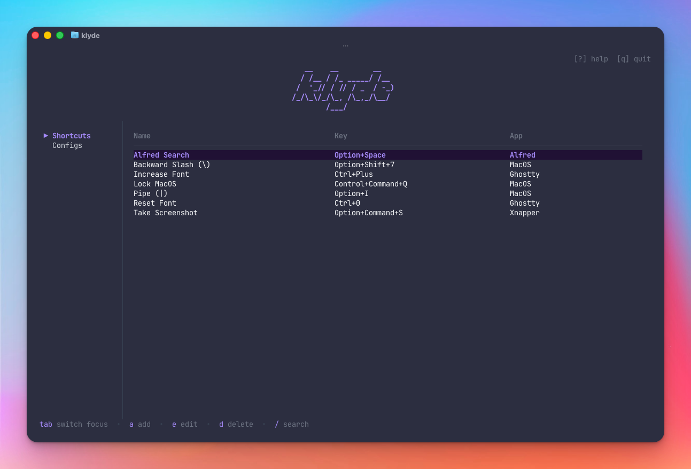
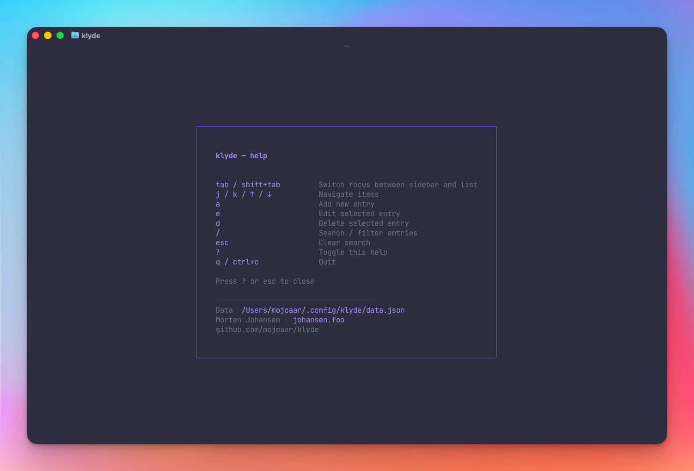

# klyde

[](https://github.com/mojoaar/klyde/releases)
[](LICENSE)

A terminal UI for tracking keyboard shortcuts and configuration files/directories.

```
  / /__ / /_ _____/ /__ 
 /  '_// / // / _  / -_)
/_/\_\/_/\_, /\_,_/\__/ 
        /___/           
```

## Screenshots




## Features

- **Shortcuts** — track key combos with name, key, app/context, and tags
- **Configs** — track config file/directory paths with name, path, type, and tags
- Add, edit, and delete entries interactively
- Live search/filter within each section
- Alphabetically sorted lists
- Help overlay with keybindings and data file location
- Cross-platform: macOS, Linux, Windows

## Installation

### Global install via Go
```sh
go install github.com/mojoaar/klyde@latest
```
This places `klyde` in `~/go/bin`. Make sure it's on your PATH:
```sh
# add to ~/.zshrc or ~/.bashrc
export PATH="$PATH:$(go env GOPATH)/bin"
```

### From source
```sh
git clone https://github.com/mojoaar/klyde.git
cd klyde
make install   # builds and installs to ~/go/bin
```

### Pre-built binaries
Run `make build` to compile for all platforms — binaries are placed in `dist/`.

## Data

Data is stored at:

| OS | Path |
|----|------|
| macOS | `~/.config/klyde/data.json` |
| Linux | `~/.config/klyde/data.json` |
| Windows | `%AppData%\klyde\data.json` |

The file is plain JSON and can be edited directly in any text editor.

## Building

```sh
make build      # cross-compile for all platforms → dist/
make install    # build and install to ~/go/bin
make uninstall  # remove from ~/go/bin
make clean      # remove dist/
```

| Binary | Platform |
|--------|----------|
| `klyde-darwin-arm64` | macOS Apple Silicon |
| `klyde-darwin-amd64` | macOS Intel |
| `klyde-linux-amd64` | Linux x86_64 |
| `klyde-linux-arm64` | Linux ARM |
| `klyde-windows-amd64.exe` | Windows x86_64 |

## Usage

| Key | Action |
|-----|--------|
| `tab` / `shift+tab` | Switch focus between sidebar and list |
| `j` / `k` / `↑` / `↓` | Navigate items |
| `a` | Add new entry |
| `e` | Edit selected entry |
| `d` | Delete selected entry (with confirmation) |
| `/` | Search / filter |
| `esc` | Clear search |
| `?` | Toggle help overlay |
| `q` / `ctrl+c` | Quit |

## Sections

- **Shortcuts** — keyboard shortcuts with name, key combo, app/context, and tags
- **Configs** — config file/directory paths with name, path, type (`file` or `directory`), and tags

## Author

Morten Johansen | [johansen.foo](https://johansen.foo)  
[github.com/mojoaar/klyde](https://github.com/mojoaar/klyde)

## Changelog

### v0.1.0
- Initial release
- Add, edit, delete keyboard shortcuts and config paths
- Live search/filter within each section
- Alphabetical sorting by name
- Help overlay with keybindings, data file path, and version
- Cross-platform: macOS, Linux, Windows
- Data stored at `~/.config/klyde/data.json` (macOS/Linux) or `%AppData%\klyde\data.json` (Windows)
